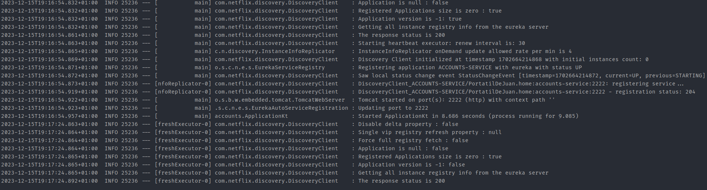
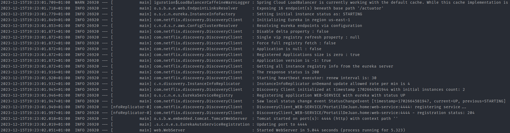
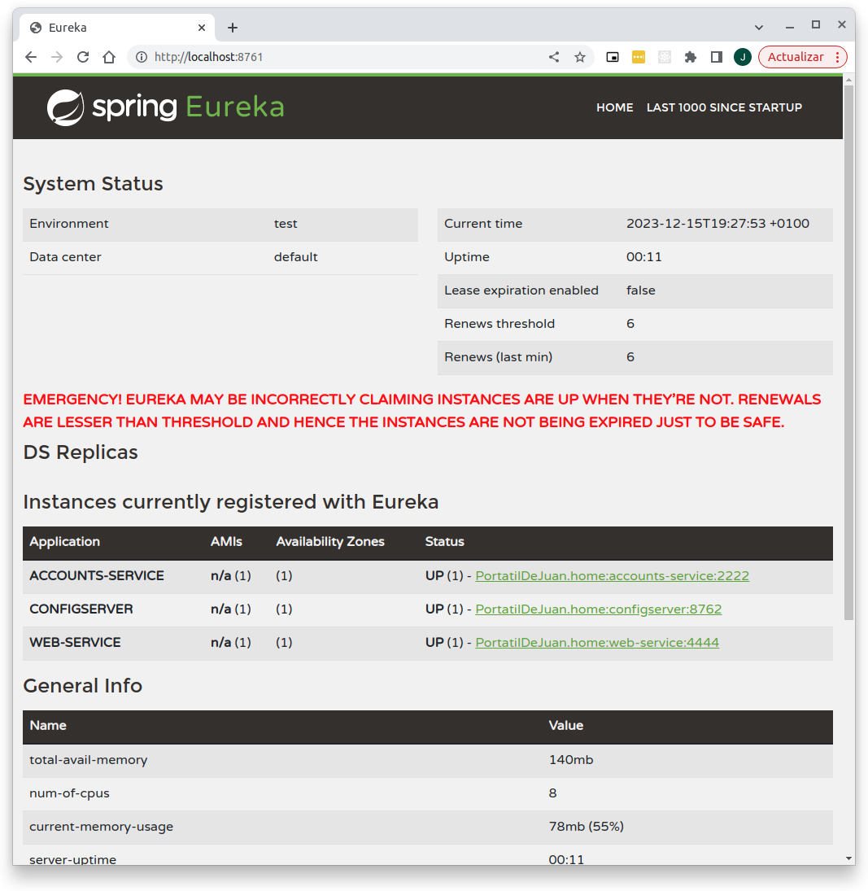
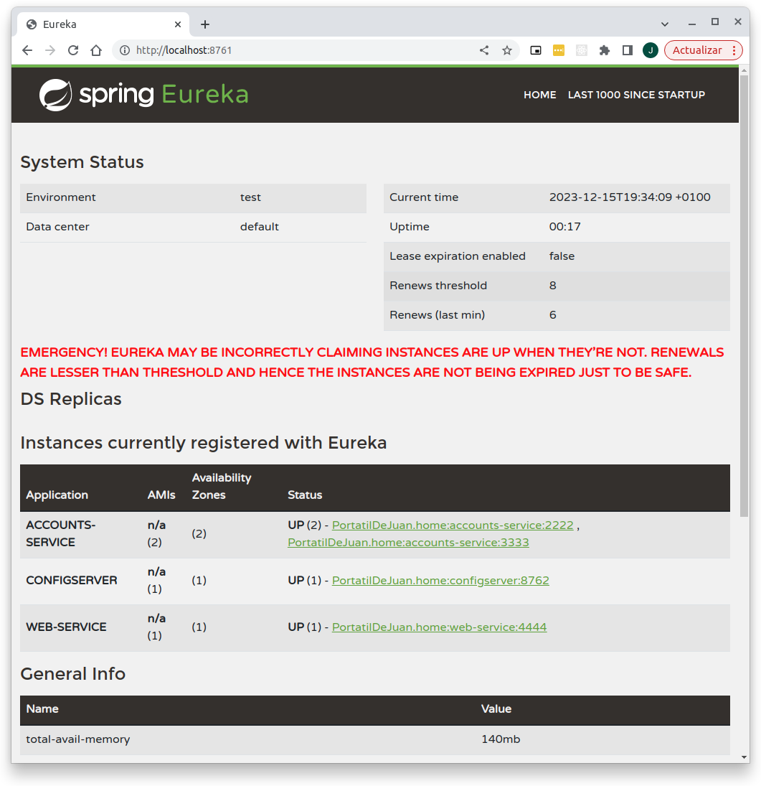
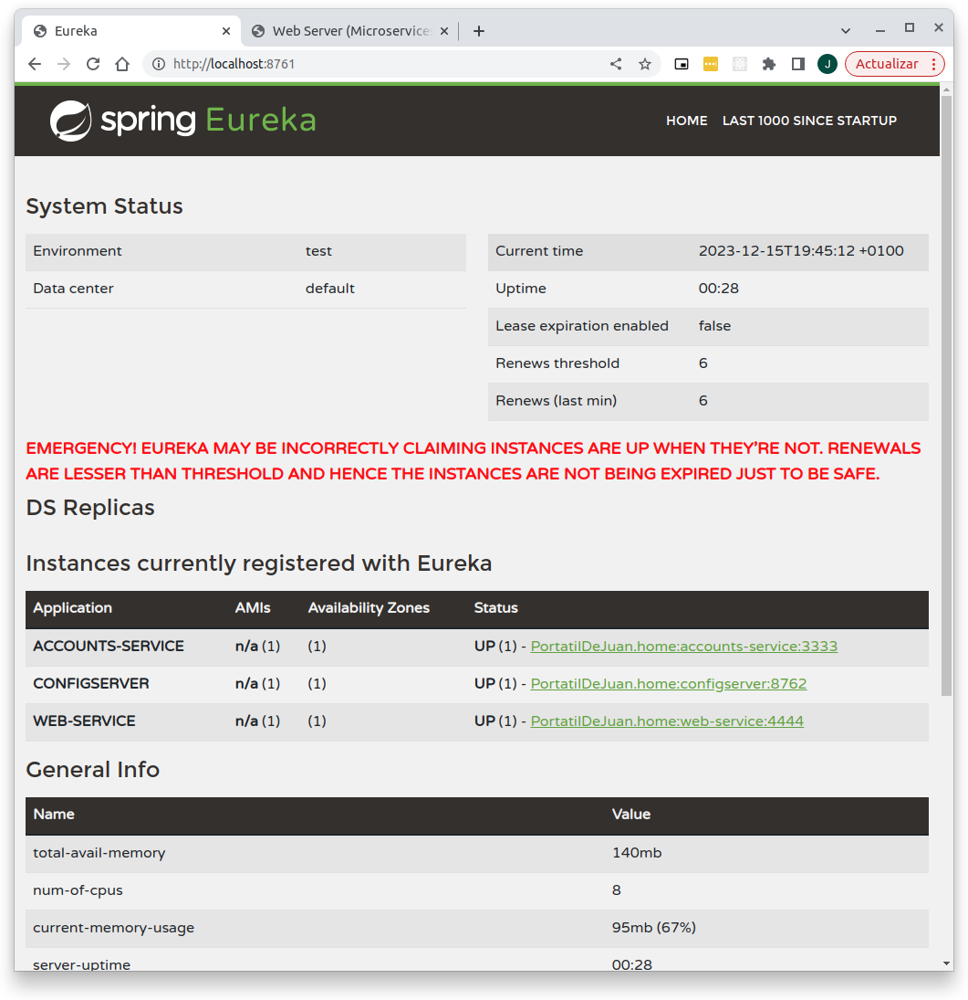

# Report
## Configuration repository
You can find my own configuration repository on the next [GitHub link](https://github.com/juan-catalan/lab6-microservices-config-repo)
## Two services accounts (2222) and web are running and registered (two terminals)
### Accounts Service launched on port 2222

### Web Service launched on port 4444

## The service registration service has these two services registered

## Update the configuration repository so that the accounts service uses now the port 3333. [Link to the commit](https://github.com/juan-catalan/lab6-microservices-config-repo/commit/8894a4fd4f4ba33770bba4959d2dd063fea14597)
## A second instance of the accounts service is run using the new configuration
Both of the instances of the accounts service are running simultaneously and both are registered in Eureka.

## Kill Accounts Service at port 2222 and do a request to Web Service
Eureka detekt that the Account Service has failed and deleted it from the list of Account Services.
### Can the web service provide information about the accounts again?
Yes, Web Service can still do request to the Accounts Service because Eureka updated their list and when Web Service asked them for the Account Service Eureka can answer with an alive Account Service  
